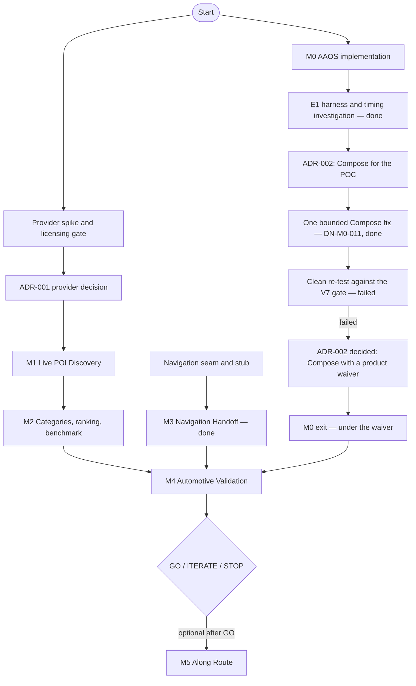

# Discover Nearby — AAOS POC Delivery Plan

**Status:** Proposed — Revision 4.1 (current-status amendments through 2026-10-06)

**Platform:** Android Automotive OS  
**Phase:** Proof of Concept  
**Owners:** Product Lead + Android/Tech Lead  
**Last Updated:** 2026-10-06

> **Current gates (2026-10-07):** **ADR-002 is decided: stay on Compose for the emulator POC, with a product waiver.** V7 failed its clean re-test after the one bounded Compose fix and stays recorded as failed; Product waives the focus jump after Back to Discover for this iteration, so **M0 exits under the waiver**. E1's pre-registered classification was inconclusive, but its results strongly implicate `uiautomator` polling at launch rather than wait duration (no-poll arms 20/20; launch-poll arms 14/19 failures; mid-journey dump 9/9). E1 is diagnostic and does not establish the underlying cause or pass V7. That decision allowed one bounded Compose fix, then a clean re-test, which V7 failed. V4: HERE is provisionally selected (ADR-001, 2026-10-07; Legal sign-off on provider terms pending before production), so M1 can start. The POC target is a sideloaded debug build on the `AAOS_AOSP_33_userdebug` emulator; production distribution is undecided and outside this POC. V8 does not block POC work.
>
> Items marked **⚠ Verify** are assumptions that have not been confirmed against primary documentation or a licence. They are tracked in §9 and must not be treated as settled.
>
> **Revision 4:** The UI is built in Kotlin + Jetpack Compose as a distraction-optimized AAOS activity, replacing Car App Library templates. Decisions 1 and 4, the build and test baselines (§2, §3) and the verification register (§9: V1 closed, V2 restated, V7 and V8 added) change accordingly.
>
> **Revision 4.1:** "Parked" in the engineering sense now means *the UX restrictions don't require distraction optimization* (`DrivingState.distractionOptimizationRequired == false`). The app reads UX restrictions, not the gear; AOSP advises against inferring driving state from them ([AOSP](https://source.android.com/docs/automotive/driver_distraction/consume)). V8 is confirmed from the AAOS developer guide.

---

## 1. Kickoff Decisions

The decisions below record the original kickoff baseline. Their current status and owners are in §9; use that register rather than this historical kickoff wording to determine active blockers.

1. The current implementation uses **Kotlin + Jetpack Compose** as one distraction-optimized activity on Android **API 29+**. ADR-002 keeps Compose for the emulator POC (2026-10-06, after the V7 re-test, with a product waiver). Production distribution and OEM validation stay open.
2. Use **fake POI data** for M0 while the provider spike runs.
3. The **Android/Tech Lead** owns the provider spike. **Product** owns data-quality approval. **Licensing** is confirmed by a Product/Legal/Business owner, not by engineering alone.
4. The test baseline is **Compose UI tests (Robolectric) + unit tests + emulator validation**.
5. **Product** owns the recommendation benchmark and the final go/no-go decision.
6. **M0 and the provider spike start in parallel.** Only M1 live integration waits for ADR-001.
7. **REST only, no provider SDK, for M1–M4.** The spike is **3 working days, no extensions**, ending in Selected, Provisionally selected, or No viable provider.

---

## 2. Build Baseline

| Area | Decision |
| --- | --- |
| Minimum Android SDK (automotive app) | API 29 |
| UI | Current implementation: Jetpack Compose (Compose BOM, Material 3), `activity-compose`, `navigation-compose`, `lifecycle-viewmodel-compose`. Kept for the emulator POC by ADR-002 (2026-10-06, with a product waiver after the failed V7 re-test). |
| Car API | `android.car` (`optional/android.car.jar`, `compileOnly`) for `CarUxRestrictionsManager`, as in NyasaPlayer |
| Testing | JUnit + coroutines-test + Robolectric + Compose UI test (`ui-test-junit4`). The project uses Robolectric 4.17 and `testOptions.unitTests { isIncludeAndroidResources = true; isReturnDefaultValues = true }` |
| Emulator | `AAOS_AOSP_33_userdebug` AVD, as used for NyasaPlayer (Test & Demo Plan §2) |
| Distribution | This iteration targets a sideloaded debug POC on the AAOS userdebug emulator. Production distribution is undecided and outside this POC's scope; Product must choose a supported route before production planning (V8). An OEM-preinstall route requires OEM confirmation. No Play submission, Play quality review or release signing in the POC: it needs to work first. |
| Language / async | Kotlin, Coroutines |
| HTTP | OkHttp |
| JSON | kotlinx.serialization |
| Architecture | Single application module, package-per-concern, manual constructor injection |
| DI framework | None |
| Database | None initially |
| Screen navigation | Navigation Compose |
| UI state | A `ViewModel` per content screen, `StateFlow`, created from `AppContainer` |
| Map | None |
| POI | Repository abstraction; `FakePlacesRepository` in M0 |
| Routing | Not until M5 |
| Stub navigation app | Separate tiny APK in `tools/stub-navigation/` |

### Version policy

- Pin Kotlin, AGP and the Compose BOM to current stable releases at M0, and record them here.
- No alpha or RC dependencies unless a concrete blocker appears that stable cannot solve. Any such change needs a short note in this document.
- No Car App Library dependency.

Pinned at M0 (DN-M0-009, DN-M0-012, DN-M0-001; checked 2026-10-02):

| Area | Version |
| --- | --- |
| AGP / built-in Kotlin / Gradle | 9.2.1 / 2.2.10 / 9.4.1 |
| compileSdk / targetSdk / minSdk | 37 / 36 / 29 |
| Compose BOM | 2026.09.00 (ui 1.12.1, material3 1.4.0) |
| activity-compose / navigation-compose / lifecycle | 1.13.0 / 2.10.2 / 2.11.0 |
| core-ktx | 1.19.1 |
| kotlinx.coroutines / kotlinx.serialization | 1.11.0 / 1.11.0 |
| OkHttp | 5.5.0 |
| JUnit / Robolectric (runs at SDK 36) | 4.13.2 / 4.17 |
| detekt | 1.23.8 |

Lint reports newer AGP (9.4.1), Gradle (9.8.0) and Kotlin plugins (2.4.20). These are deferred toolchain upgrades, not M0 work; targetSdk 36 is deliberate.

### HTTP / JSON policy

**REST only for the core POC (M1–M4).** Provider APIs are called directly with OkHttp + kotlinx.serialization through our own client and mapper. No provider SDK: M1–M4 need no map renderer, navigation engine, positioning stack, offline maps, SDK UI or route guidance. If M5 later needs an SDK, it gets its own ADR at that point. This closes V5.

```text
AAOS app → PlacesRepository → provider REST client (OkHttp + kotlinx.serialization) → HTTP
```

### 2a. Provider defaults until ADR-001

**Caching.** Do not persist provider POI responses unless ADR-001 explicitly allows it:

```text
in-memory response → display → discard when the session ends
```

Providers differ. HERE, for example, restricts prefetching, caching or storing Location Services results except where caching headers allow it. ADR-001 records the chosen provider's rule.

**API key.**

```text
API key → local.properties → BuildConfig → never committed to Git
```

Use a dev-only key with low quota that is easy to revoke, and no production credentials. A client-side key can always be extracted, so this is not production security. If the provider requires a backend proxy, device authentication, signed tokens or an SDK credential mechanism, ADR-001 records that as additional scope.

**Attribution.** Record the exact rule in ADR-001 before designing any attribution UI. OSM, for example, requires attribution and ODbL notice.

### Driving restrictions

The app reads `CarUxRestrictions` through the Car API, using NyasaPlayer's `CarUxRestrictionsHandler` as the reference. The activity is declared `distractionOptimized`. `DrivingState` reports UX restrictions (`distractionOptimizationRequired`, `listLimit`), never the gear. That declaration is only honest once list limits, restriction-gated Grant, touch targets and rotary focus are in place.

---

## 3. Test Baseline

Three layers:

```text
┌───────────────────────────────┐
│ AAOS emulator                 │  touch, rotary, Back, permission,
│ (manual / scripted scenarios) │  Park/Drive, location change, full flow
└──────────────▲────────────────┘
               │
┌──────────────┴────────────────┐
│ Compose UI tests              │  screens → states, state transitions,
│ (Robolectric)                 │  navigation intents, gated Grant
└──────────────▲────────────────┘
               │
┌──────────────┴────────────────┐
│ Unit tests (JVM)              │  ranking, category mapping,
│                               │  provider → domain mapping, stale requests
└───────────────────────────────┘
```

**Automated**

- recommendation scoring and ordering
- category mapping
- provider → domain mapping (recorded fixtures, after ADR-001)
- loading / content / error transitions
- each screen renders each state
- navigation intent, checked via Robolectric `nextStartedActivity`
- Grant offered only when distraction optimization is not required
- stale-request handling

**Emulator**

- touch, rotary and Back
- the location permission flow
- Park / Drive
- location changes
- the full user flow
- visual sanity

Compose UI tests run as **local Robolectric tests** (V2, NyasaPlayer's setup). M0 includes one smoke test that renders `DiscoverScreen`, to verify our project configuration.

Robolectric does not replace the emulator. Rotary, focus, and Park/Drive remain **emulator-tested**.

---

## 4. Provider Spike

### Objective

> Select a POI provider that is legally usable in an embedded vehicle application and whose data is good enough to prove Coffee, Family and Scenic.

### Constraints

- **Time-boxed: 3 working days.** No extensions.
- **Three candidates, investigated in this order:**
  1. **TomTom.** Strongest technical fit: its Search API offers category/POI search and Along Route Search (relevant to M5). TomTom's newer Places Search API does not currently offer along-route search, and the older Search API remains supported where that is needed. Being an automotive company does **not** by itself prove that the specific plan we sign up for permits this AAOS use; that needs contractual confirmation.
  2. **HERE.** Its general Platform Terms permit integrating its APIs into applications, subject to the specific subscription plan and product terms. Plausible, but licensing confirmation is still required.
  3. **One named OSM-backed option**, chosen at kickoff: a specific hosted OSM-based service, or a self-hosted approach. "OSM-based" alone is not a provider decision. OSM *data* is reusable under ODbL with attribution; the question is the *service layer*. Public OSM services such as Nominatim have strict usage limits and are not a basis for the app. OSM is a useful control, but likely weaker on ratings and other quality signals.

  These are signals from public documentation reviewed during planning, not approvals.
- **Not a research project.** Stop when one provider clearly qualifies or none does.

### Test matrix (identical for every provider)

| | Greystones | Dublin | Galway |
| --- | --- | --- | --- |
| Coffee | Test | Test | Test |
| Family | Test | Test | Test |
| Scenic | Test | Test | Test |

For every query, capture:

```text
Place ID
Name
Coordinates
Place types
Distance
Rating?
Rating count?
Opening state?
Parking?
Toilets?
Family-related information?
Attribution requirement
Latency
```

Outputs go into ADR-001 (`adr/0001-poi-provider.md`). Recorded test fixtures are created only after confirming the chosen provider's terms allow storing responses for testing.

### Day-3 outcome (no extensions)

At the end of the time-box, exactly one of these is recorded in ADR-001:

| Outcome | Meaning | Next step |
| --- | --- | --- |
| **Selected** | Data fit and licence confirmed | M1 |
| **Provisionally selected** | Technical/data fit confirmed; licensing clarification pending | M1 only with explicit risk acceptance by the Product Lead |
| **No viable provider** | No candidate is both usable and good enough | Stop / rethink data strategy |

### One-sheet comparison

| Question | TomTom | HERE | OSM option |
| --- | --- | --- | --- |
| AAOS / embedded vehicle use permitted? | | | |
| Evidence / contractual source | | | |
| REST POI search | | | |
| Nearby / category search | | | |
| Along-route capability | | | |
| Coffee coverage | | | |
| Family coverage | | | |
| Scenic coverage | | | |
| Rating / count | | | |
| Opening hours | | | |
| Useful amenities | | | |
| Attribution | | | |
| Caching restrictions | | | |
| Authentication model | | | |
| POC cost | | | |
| Production path plausible | | | |


### Sign-off

| Question | Signs off |
| --- | --- |
| Is the data good enough to prove Coffee, Family and Scenic? | Product Lead |
| Is the licence suitable for embedded automotive use? | Product / Legal / Business owner |
| Is the API technically workable? | Android/Tech Lead |

If licensing cannot be formally confirmed within the time-box, ADR-001 may be recorded as:

> **Status: Provisionally selected, pending licensing confirmation**

M1 may begin against a provisionally selected provider. **Engineering must not interpret ambiguous licence language itself.** If confirmation later fails, the repository boundary limits the rework to the provider package and fixtures.

---

## 5. Ownership

Roles first; names are filled in at kickoff. One person may hold several roles.

| Responsibility | Role | Name |
| --- | --- | --- |
| Product scope | Product Lead | [NAME] |
| Provider technical investigation | Android/Tech Lead | [NAME] |
| Provider licensing confirmation | Product / Legal / Business owner | [NAME] |
| Data-quality assessment | Product Lead | [NAME] |
| M0 AAOS skeleton | Android Engineer | [NAME] |
| M1 provider integration | Android Engineer | [NAME] |
| Recommendation engine | Android Engineer | [NAME] |
| Relevance benchmark | Product Lead | [NAME] |
| Emulator validation | Android Engineer | [NAME] |
| Go / no-go decision | Product Lead | [NAME] |

Product Lead, benchmark reviewer and go/no-go owner may be the same person. **Keep licence confirmation separate from engineering wherever possible.**

---

## 6. Relevance Benchmark Ownership

- **Engineering** produces recommendations consistently and records them for each cell.
- **Product** decides whether they demonstrate the product proposition.

Recording format, per cell:

```text
Greystones × Family

1. Harbour Playground       ACCEPT
2. Family restaurant        ACCEPT
3. Petrol station           REJECT

Top result relevant?       YES
2 of top 3 useful?         YES
Obviously wrong #1?        NO
Notes:                     sparse amenity data
```

Rules are as defined in the Product Brief §11 and Test & Demo Plan §4. Product's sign-off is the **exit condition for M2**.

---

## 7. Go / Iterate / Stop

Decided by the Product Lead at the end of M4.

| Outcome | Conditions |
| --- | --- |
| **GO** — continue to M5 / real-hardware exploration | AAOS flow works **and** the provider is legally viable **and** recommendations are reasonably useful **and** the interaction feels appropriate in the emulator **and** no architectural blocker was found |
| **ITERATE** — tune categories, provider or ranking | AAOS flow works **but** recommendation quality is weak |
| **STOP** | No commercially usable data source, **or** AAOS constraints prevent the intended interaction, **or** recommendations don't provide meaningful value |

GO also names the distribution path (V8): Play, OEM/preinstall, or a template UI layer for Play. An unresolved V8 does not block GO, but it must be settled before any production planning.

---

## 8. Timeline and Dependencies

### Confidence levels

| Work | Estimate type | Notes |
| --- | --- | --- |
| M0 AAOS skeleton | **Firm date** | Set at kickoff: [DATE] |
| Provider spike → ADR-001 | **Firm date** | Time-box ends: [DATE] |
| M1 Live POI discovery | Range | Re-estimate after ADR-001 |
| M2 Categories + ranking + benchmark | Range | Re-estimate after ADR-001 |
| M3 Navigation handoff | Range | Largely provider-independent |
| M4 Automotive validation | Range | Largely provider-independent |
| M5 Along Route (stretch) | Not estimated | Only after GO |

No dates are fixed in this document; they are set at kickoff.

### Dependency graph



M0's implementation is largely complete. E1 is done; V7 failed its clean re-test after the one bounded fix, and ADR-002 keeps Compose with a product waiver, so M0 exits under the waiver. M3 is complete and provider-independent. M1 waits on ADR-001; M4 validates the complete core flow after the provider, ranking, navigation, and M0 gates are satisfied.

---

## 9. Verification Register

**Current milestone gates:** M0 has exited under ADR-002's product waiver: V7 failed its clean re-test after the one bounded fix (2026-10-06) and stays recorded as failed. V4: HERE provisionally selected (Legal pending before production); M1 can start. V6a–c are provider facts captured while making ADR-001. V8 is a confirmed distribution constraint, but the production route remains open and does not block this POC; Product must settle it before production planning.

Status key: 🔴 open · 🟡 captured by ADR-001 · 🟢 closed / resolved.

| ID | Decision / item | Status | Owner | Blocks |
| --- | --- | --- | --- | --- |
| **V4** | **The provider gate:** which provider/service combination is commercially and legally usable for an embedded AAOS application? Raw OSM data and an OSM-backed hosted service are different things; the question is about the combination we would actually use. | 🟡 **Provisionally selected: HERE** (ADR-001, 2026-10-07): live matrix done; Legal sign-off on provider terms pending before production | Product/Legal/Business owner (licence); Tech Lead (technical) | **M1** |
| V5 | Provider SDK licence | 🟢 **Closed.** The core POC uses REST only, with no provider SDK (§2). Any SDK need in M5 gets its own ADR. | — | Nothing |
| V6a | Provider attribution requirements | 🟡 Captured by ADR-001 | Tech Lead | M1 completion |
| V6b | Provider caching/storage rules | 🟡 Captured by ADR-001. Until then: no persistence (§2a). | Tech Lead | M1 completion |
| V6c | Provider API-key/auth model | 🟡 Captured by ADR-001. Until then: dev-only key (§2a). | Tech Lead | M1 integration |
| V7 | Rotary focus in Compose on the reference AAOS image (controller rotation on Android 13; nudging is not a POC requirement). **Gate** (ADR-002, 2026-10-06): rotary reaches Navigate, selection activates the focused control, Back returns to a usable screen without losing a turn, and every actionable control shows visible focus. Where focus lands after Back is recorded, not gated. | 🔴 **Failed (clean re-test, 2026-10-06); waived by Product for this iteration** ([ADR-002](adr/0002-ui-stack-after-v7.md#decision)): the focus jump after Back to Discover is a known limitation of the emulator POC; the record stays failed. After one bounded Compose fix (DN-M0-011: a focus ring on every actionable control; rotary focus returned to the selected item after Back), four behavioural runs (3 parked, 1 in Drive; adb-injected, no `uiautomator`): Navigate reached and activated 4/4; visible focus on every control; Back to Details and to Recommendations without a lost turn 4/4, fixing E1's lost turn. Back to Discover failed in 1 of 4 runs: the ring was restored on Family, but Compose reported only the host to the rotary service, so the next turn jumped to Coffee. The rule fixed before the run needs all four runs to pass. The `uiautomator` control is reported separately; the manual Extended Controls run is pending and recorded separately. Details: [ADR-002](adr/0002-ui-stack-after-v7.md#v7-re-test-after-the-bounded-fix-dn-m0-011-2026-10-06). Earlier E1's pre-registered classification was inconclusive; its run pattern strongly implicated launch-time polling but did not prove the underlying cause. | Product Lead (waiver) | M0 exit (waived, 2026-10-06); GO ("AAOS flow works") |
| V8 | Production distribution path. **Constraint confirmed (2026-10-02):** Play permits `distractionOptimized` only on the Car App Library's `CarAppActivity`; a Compose POI UI therefore needs a compatible template UI for Play or a supported alternate route such as OEM preinstall ([AAOS guide](https://developer.android.com/training/cars/platforms/automotive-os)). | 🟡 Constraint captured; production route undecided and outside this POC. Product must choose before production planning; OEM preinstall needs OEM confirmation. Not blocking POC work. | Product Lead | Production planning |
| V1 | `minCarApiLevel = 4` supports AAOS | 🟢 Closed for the current Compose baseline (Rev 4; no Car App API level required). Reopens only if ADR-002 reopens and chooses Car App Library templates. | — | Revisit if ADR-002 reopens |
| V2 | How automated UI tests run | 🟢 Resolved for the current Compose baseline: Compose UI tests under Robolectric, as on NyasaPlayer; one M0 smoke test checks project configuration; rotary and Park/Drive stay emulator-tested. Reopens only if ADR-002 reopens and chooses templates. | — | Revisit if ADR-002 reopens |
| V3 | Emulator image and driving-state tooling | 🟢 Resolved. NyasaPlayer's `AAOS_AOSP_33_userdebug` AVD and adb driving-state commands (Test & Demo Plan §2). | — | Nothing |

**V3 detail (from NyasaPlayer `docs/AAOS_DRIVING_STATE_TESTING.md`):**

- The `userdebug` AVD honours `distractionOptimized` for sideloaded debug builds, and accepts adb gear/speed commands, including continuous speed events for a sustained "moving" state.
- The Play image refuses those commands and blocks debug-signed apps while driving, so the POC doesn't use it.
- NyasaPlayer's car UI is a custom Compose activity, the same approach as Discover Nearby (Rev 4), so its driving-state findings apply directly.

The Rev 3 facts about Car App Library 1.7.0, `TestCarContext` and Car App API `LEVEL_4` are kept in `archive/rev3/`. They no longer apply.

Provider signals used to order the spike (from public documentation reviewed during planning; not approvals):

- [TomTom: choosing a Search API](https://docs.tomtom.com/search-api/documentation/product-information/choosing-a-search-api)
- [HERE Platform Terms](https://legal.here.com/us-en/terms/here-platform-terms)
- [HERE API keys](https://docs.here.com/identity-and-access-management/docs/plat-using-apikeys)
- [OSMF Nominatim usage policy](https://operations.osmfoundation.org/policies/nominatim/)
- [OSM attribution](https://wiki.openstreetmap.org/wiki/Attribution)
